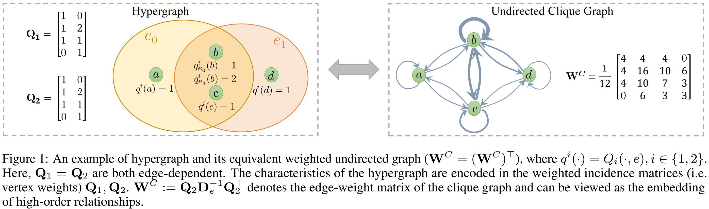

# Hypergraph Convolutional Networks via Equivalency Between Hypergraphs and Undirected Graphs

This is a Pytorch implementation of the following paper:

ICML22 workshop-[Hypergraph Convolutional Networks via Equivalency Between Hypergraphs and Undirected Graphs](https://arxiv.org/abs/2203.16939)

If you make use of the code/experiment in your work, please cite our paper (Bibtex below).

```
@inproceedings{zhang2022hypergraph,
  title={Hypergraph Convolutional Networks via Equivalency between Hypergraphs and Undirected Graphs},
  author={Zhang, Jiying and Li, Fuyang and Xiao, Xi and Xu, Tingyang and Rong, Yu and Huang, Junzhou and Bian, Yatao},
  booktitle={ICML 2022 Workshop on Topology, Algebra, and Geometry in Machine Learning},
  journal={arXiv preprint arXiv:2203.16939},
  year={2022}
}
```

## Installation
The main dependency packages are:

```
python 3.8.6; 
pytorch 1.6.0;  
scipy 1.6.0.
```
The complete environment can be installed on anaconda by 
`conda env create -f`
 [environment.yaml](environment.yaml).
## 1. Citation network classification
### H-GCN
To train and evaluate H-GCN on dataset cocitation/pubmed:


```
python train.py --data_path ./data --save_dir ./ --print_freq 100 --epochs 1000 --hidden 128 --gpu 2 --type gcn --split 1 --dropout 0.5 --weight_decay 0.0005 --sigma -1 --nbaseblocklayer 2 --activate_dataset cocitation/pubmed
```
   

### H-GCNII

To train and evaluate H-GCNII on dataset cocitation/cora:
```
python train.py --activate_dataset cocitation/cora --data_path ./data --save_dir ./ --print_freq 100 --epochs 1000 --gpu 0 --type gcnii --split 1 --lr 0.01 --wd1 0.01 --dropout 0.5 --sigma -1 --degree 32
```


## 2. Visual object classification
Following [HGNN](http://gaoyue.org/paper/HGNN.pdf), the datasets can download as blow for training/evaluation  (should be placed under "data_path")
- [ModelNet40_mvcnn_gvcnn_feature](https://drive.google.com/file/d/1euw3bygLzRQm_dYj1FoRduXvsRRUG2Gr/view?usp=sharing)
- [NTU2012_mvcnn_gvcnn_feature](https://drive.google.com/file/d/1Vx4K15bW3__JPRV0KUoDWtQX8sB-vbO5/view?usp=sharing)


### H-GCN
To train and evaluate H-GCN on ModelNet40 with MVCNN+GVCNN (BOTH) structures and MVCNN+GVCNN (BOTH) features.
```
python train.py --data_path ./data --on_dataset ModelNet40 --gvcnn_feature_structure --mvcnn_feature_structure --use_gvcnn_feature --use_mvcnn_feature --save_dir ./ --is_probH --epochs 1000 --seed 1000 --hidden 128 --print_freq 100 --nhiddenlayer 1 --nbaseblocklayer 2 --dropout 0.5 --gpu 3 --type gcn --K_neigs 6 --sigma -1 --lr 0.001 --gamma 0.5 --weight_decay 0.001
```


### H-GCNII
To train and evaluate H-GCNII on  ModelNet40 with MVCNN+GVCNN (BOTH) structures and MVCNN+GVCNN (BOTH) features.

```
#python ../train.py --data_path ./data --on_dataset ModelNet40 --gvcnn_feature_structure --mvcnn_feature_structure --use_gvcnn_feature --use_mvcnn_feature --save_dir ./ --save_file ../doc/gcnii.csv --is_probH --m_prob 0.1 --epochs 1000 --seed 1000 --hidden 128 --print_freq 100 --nhiddenlayer 1 --nbaseblocklayer 0 --dropout 0.5 --inputlayer gcn --outputlayer gcn --gpu 0 --type gcnii --K_neigs 6 --sigma -1 --lr 0.001
```


